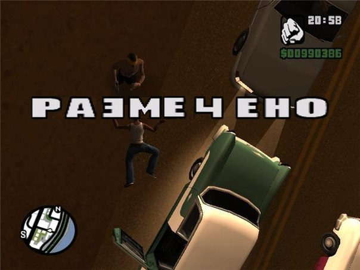

# Хакатон 7 февраля 2022

## Кто мы и чем занимаемся

Привет! Мы - команда проекта "Печатаю тебе", а именно: Тоша Лошкарёв, Марина Настас и Маша Маслова (на чьём гитхабе вы сейчас и находитесь).
Конечной целью нашего проекта является создание унифицированной базы данных оцифрованных и расшифрованных телеграмм, а также исследование полученных данных.

Сейчас перед нашей командой стоит несколько задач:
- Раздобыть максимальное количество телеграмм по друзьям и знакомым
- Обкачать [сайт](https://opendata.mkrf.ru/opendata/7705851331-museum-exhibits)
- Раздобыть хороший инструмент для считывания текста с картинок (Computer Vision)
- Сделать нашу [базу данных](https://docs.google.com/spreadsheets/d/1Ul_gCrJwwPh8sc72K8_DEqcMEcG1X9IQQPK3GqTfmvU/edit?usp=sharing) максимально удобной для последующего анализа

## Задачи
### Самая интересная
Мы хотим разработать чёткий алгоритм, с помощью которого мы (а впоследствии и другие разметчики) сможем размечать телеграммы. В частности, нас интересует:
- как можно унифицировать отправителей? отправители телеграмм часто подписываются "папа-мама", а не ФИО, поэтому возникает вопрос корректной идентификации
- придумать протокол работы с _нетрадиционной_ орфографией: дореволюционной, ошибочной 
- разработать систему обозначений и пометок (например, скобочки) для любых вносимых разметчиками изменений: как обозначать исправленную орфографию? как обозначать нечитаемый текст? 

### Если хотите что-то другое:
У нас есть здоровенная таблица в 4 гб (_и это только в заархивированном виде_), и если вы хотите просто посидеть-покодить, чтобы вас не трогали, [милости просим](https://drive.google.com/file/d/1wRiw1tiPe_lCFVsYLgeK9lz6D5ikXqns/view?usp=sharing). Задача заключается в том, чтобы обработать довольно крупную !заархивированную! таблицу и достать из неё нужные нам данные (картинка, дата и место создания).

### Чем вы ещё можете нам помочь, даже не присоединяясь к нашей команде:
Если вы знаете хороший инструмент для Computer Vision, поделитесь с нами и покажите, как он работает.

Ну и если вам не сложно, поищите, пожалуйста, у себя телеграммы :)

